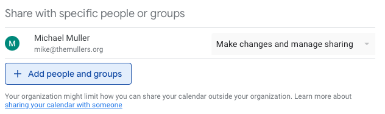
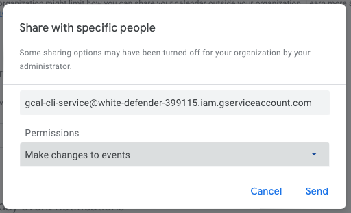
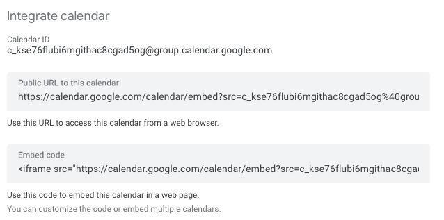

# Google Calendar CLI

I wrote this program to let me do basic calendar operations from the command line.

I'm sure there's a million better implementations, but I've never called any of Google's services 
and wanted to learn how.  It turns out calling the services is pretty straightforward, but getting 
authenticated is not.

## Service Account

This project requires credentials for a service account.

I [documented process of creating a service account](documentation/service-account.md), or at least what 
that process looks like at this point in time (September 2023), using 
[8x10 color glossy pictures with circles and arrows and a paragraph 
on the back of each one](https://youtu.be/-yLg_bzwvxg?t=291).

## Delegating Authority

You can use the certificate to grant permissions across your organization by [delegating 
domain-wide authority](https://developers.google.com/identity/protocols/oauth2/service-account#delegatingauthority).  I chose
to grant access on a calendar-by-calendar basis instead.

## Granting Calendar Access

You'll need to know your service account's email address.  If you didn't make note 
of that when you were in the cloud console, you can find it with the `gcal email` command.

Go into the Google Calendar settings area (by clicking the gear icon ⚙️).  

Then, in the left side menu, pick "Settings for my calendars", and then "Share with specific 
people or groups". 



Click the "Add people and groups" button and enter your service account's email address.



I want to be able to add events, so I selected the "make changes" option.  You could 
select a read-only option if you prefer.

## Accepting Calendar Access

Google has added a requirement that the 
service account "accept the invitation" to the shared calendar.  In order to do this, you'll 
need to know the ID of the calendar that you've shared.  

In the "Settings for my calendars" menu, chose "Integrate calendar".



This is where you can find the calendar ID. 

Now you can use this application to subscribe to that calendar:

```
$ gcal subscribe c_kse76flubi6mgithac8cgad5og@group.calendar.google.com
subscribed to c_kse76flubi6mgithac8cgad5og@group.calendar.google.com
```


