# Creating a Service Account

To use the Google Calendar APIs, you need to authenticate. The commonly-used
OAuth method is interactive; you have user a web browser to approve access.

Access without this interaction requires creation of a service account.  The process 
of creating such an account is documented here.

## Cloud Console

Visit Google's [Cloud Console](https://console.cloud.google.com) and create 
a new project.

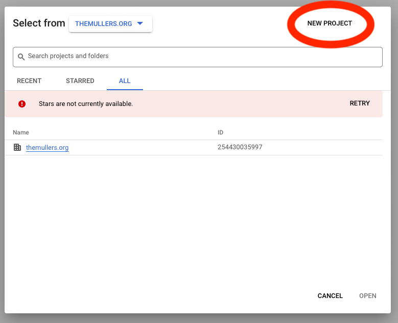

## Enter Project Name

Enter a name for the project; I specified "Google Calendar CLI".  *(CLI = command 
line interface)*

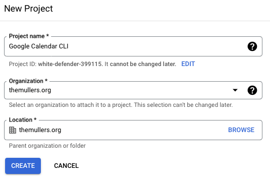

## Navigate to APIs & Services

From the "Welcome" page, click the "APIs and Services" tile.

## Enable APIs and Service

From the "APIs & Services" page, click "+ ENABLE APIS AND SERVICES".

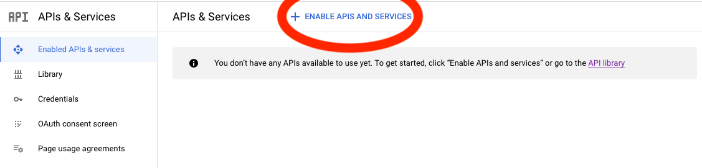

## Search for the Google Calendar API

In the API Library, search for the Google Calendar API.

Click on the Google Calendar API search result and click the "Enable" button (not shown, sorry). 

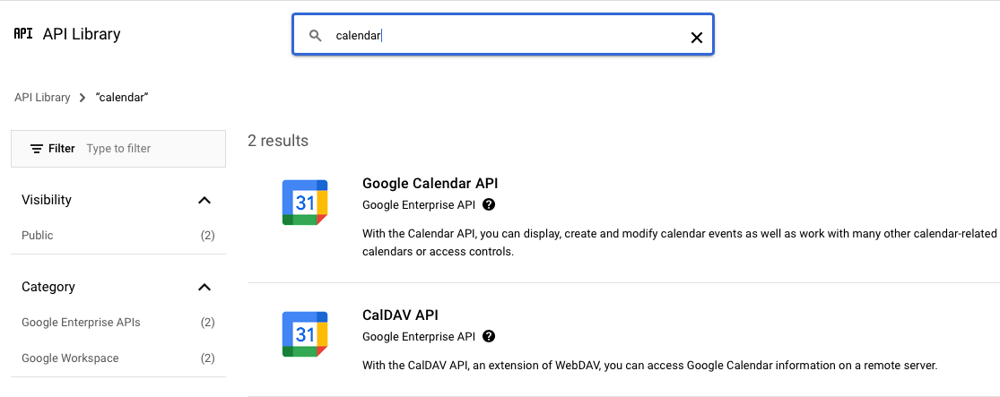

## Navigate to Create Credentials

Once you've enabled the Google Calendar API, the cloud console indicates that you need to 
create credentials in order to use the API; click the associated button.

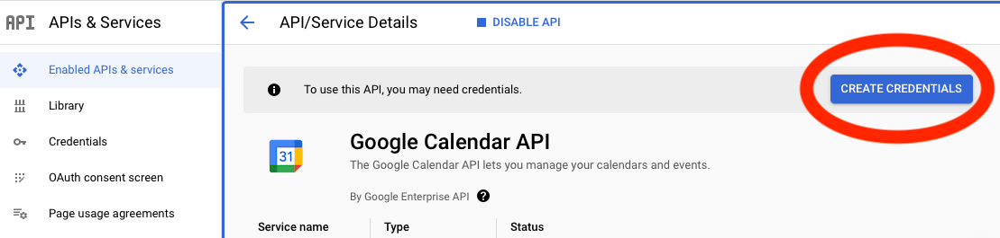

## Specify Credential Type

The "Create Credentials" button brings you to a page where you specify the type of credential you want to use.  You 
must specify "Application Data" here to create a service account.  I indicated that I am not using any of the 
cloud services and clicked "Next".

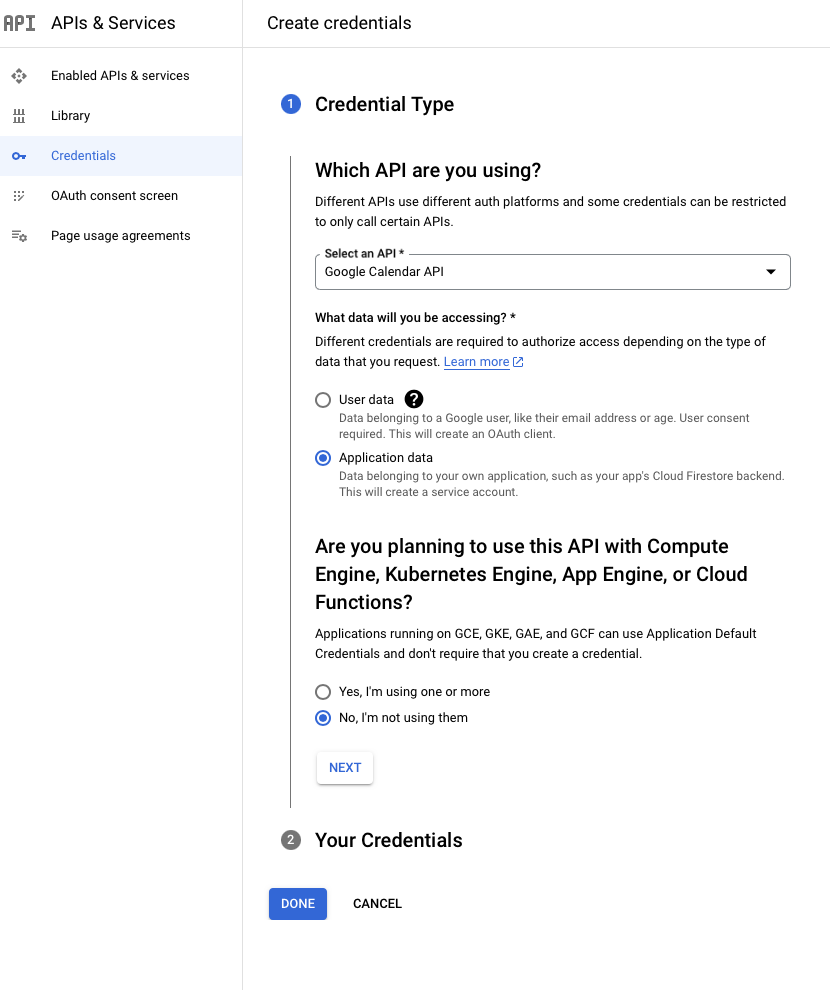

## Service Account Details

The cloud console then prompts for details: the account name, ID, and a description; enter those
 and press "CREATE AND CONTINUE".

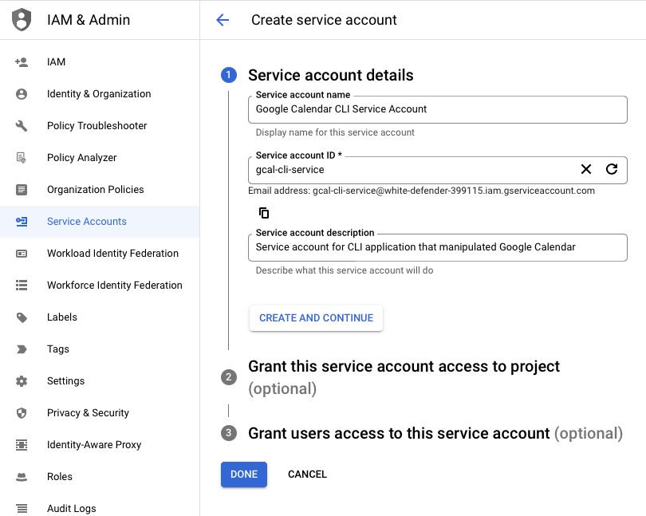

## Create Service Account

Press "DONE" from the next page to actually create the service account.

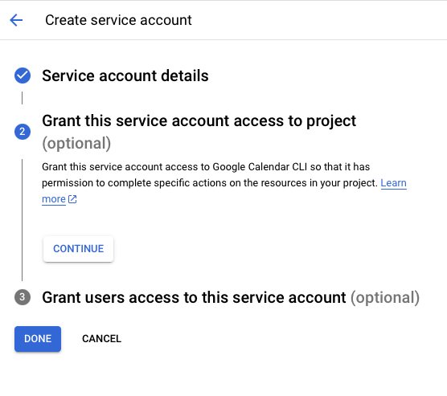

## Navigate to Service Account Details

On the "credentials" page, click on your newly-created service account's email address to 
navigate to the service account details page.  *(Note: Service account email addresses are machine-generated, 
and I can't help if they sound vaguely racist.)*

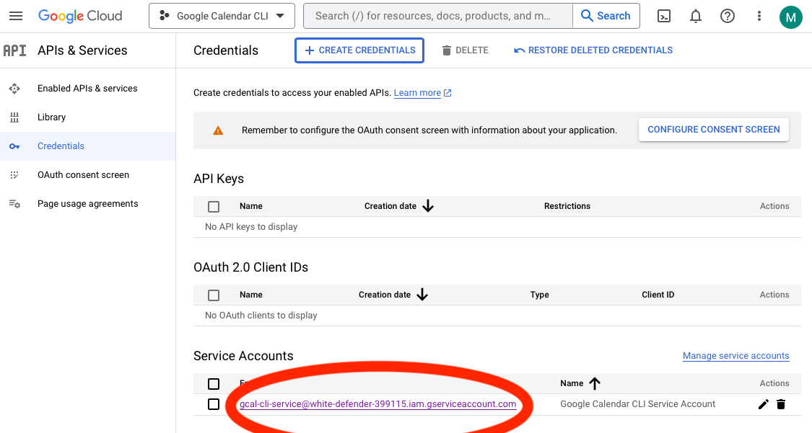

## Service Account Details

On the "service account details" page, make note of your service account's email address
and then click on the "KEYS" tab.

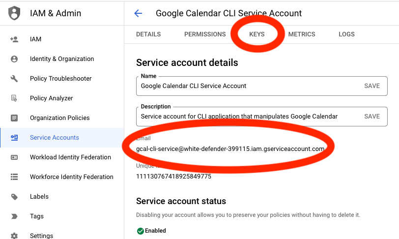

## Navigate to Create New Key

On the "KEYS" tab, use the "ADD KEY" control to create a new key.

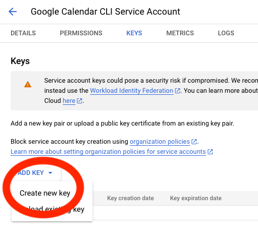

## Specify Key Type

When prompted, select the JSON key type.

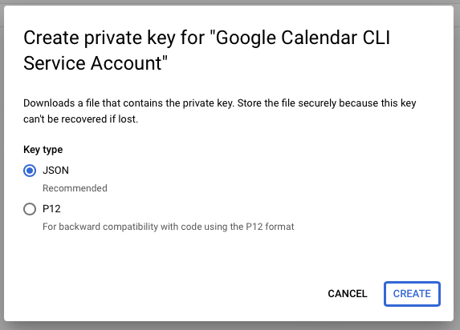

## DONE! 

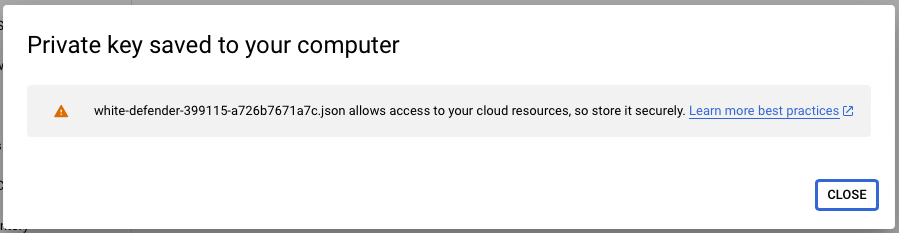

Congratulations, you've created a service account and downloaded a JSON file with 
that account's credentials.  Now you can return to the [README](../README.md) and 
continue with the setup instructions.

